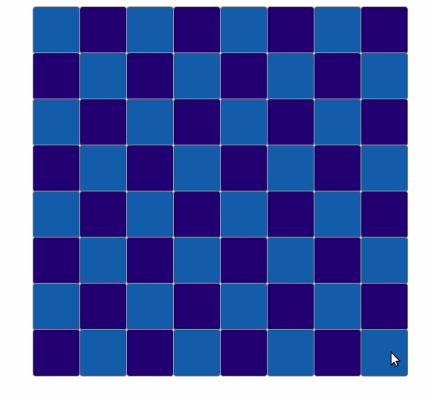

# Knight Moves

It is a small game that highlights chessboard cells corresponding to the possible positions that the piece knight on the chess can stay after playing 2 times consecutively.

It consists of a backend server in NodeJs with Express and a frontend client in ReactJs.

- Client: React
- Server: NodeJs

[](./knight_moves.gif)

## Instructions to run
Below you can find 2 ways to run this project.

### Method 1 (recommended):

#### Pre-requisites:
- [Docker](https://docs.docker.com/install/)
- [Make](https://www.gnu.org/software/make/)

```bash
# Clone repository

# Build front and run server on docker
make run-docker

# Server will be running on http://localhost:3000

```

### Method 2

#### Pre-requisites:
- [Node 12](https://nodejs.org/en/)
- [Make](https://www.gnu.org/software/make/)

```bash
# Clone repository

# Download dependencies for client and server
make install

# Generate build files for client (./build folder)
make build-front

# Run server (it will also serve the ./build folder)
make run

# Server will be running on http://localhost:3000

```

### Unit Tests

The business logic inside server/services is tested within ./tests folder using [Mocha](https://mochajs.org/) and [Chai](https://www.chaijs.com):

```bash

make test

``` 

### Audits

Run dependencies audit

```bash

make audit

``` 

## REST API Documentation

All available REST API documentation exposed by the project was documented using the [OpenAPI](https://www.openapis.org/) standard.

To view this documentation locally use the following command:
```bash
make run-swagger
```


### Deployment to Heroku or Dokku

To deploy this project to Heroku as one app only, it the server will be serving the static content of the ./client/build folder.
For that, the way I figured to make it work it is to commit the ./client/build folder to git.

```bash

# Build front needs to be done locally
make build-front

# And on .gitignore ./client/build folder needs to be removed
# So the static files are commited when sent to heroku/dokku

```

After this the normal procedure for a Heroku app deploy can be done.


### Further details:
After clicking the square in the chessboard, a GET request passing the position in algebric format (e.g.:A8, D5, H1) as param in the URL.
The string of the position will be checked in the server according to a regex, and if it passes then the calculation of the possible knight moves for 2 turns in advance are made and the result with an array with all the positions in algebric format is sent to the client that highlights the corresponding cells that are already mapped.


