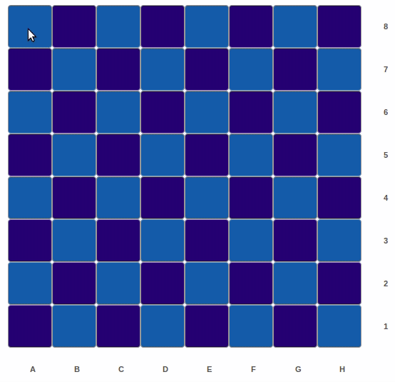

# Knight Moves

It is a small game that highlights chessboard cells corresponding to the possible positions that the piece knight on the chess can stay after playing 2 times consecutively.

It consists of a backend server in NodeJs with Express and a frontend client in ReactJs.

- Client: React
- Server: NodeJs

[](./knight_moves.gif)

## Pre-requisites:
### Node and Make installed

## Usage instructions
```bash
# Clone repository

# Download dependencies for client and server
make install

# Generate build files for client (./build folder)
make build-front

# Run server (it will also serve the ./build folder)
make run

# Server will be running on http://localhost:3000

```

### Further details:
After clicking the square in the chessboard, a GET request passing the position in algebric format (e.g.:A8, D5, H1) as param in the URL.
The string of the position will be checked in the server according to a regex, and if it passes then the calculation of the possible knight moves for 2 turns in advance are made and the result with an array with all the positions in algebric format is sent to the client that highlights the corresponding cells that are already mapped.